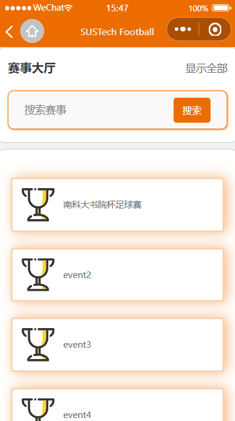
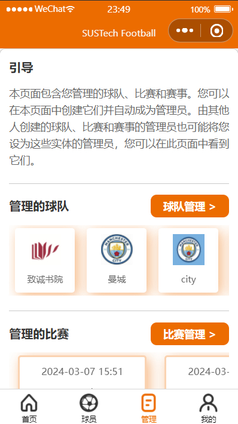

# 南科大足球赛事系统小程序——用户文档

南科大足球赛事系统小程序

本项目是一款服务于南科大的足球赛事系统小程序，该小程序主要服务于南科大体育中心和校内各足球队，面向全体南科人，旨在促进南科大足球发展，为关注南科大足球和热爱足球的南科人提供更多的信息渠道和便利。

本项目的使用主要可以分为四个部分，每个部分对应不同的功能：

- 主页面部分：展示用户关注的球员、球队、比赛、赛事，以及新闻。用户可以查看某球员、球队、比赛、赛事的具体信息和访问新闻的网页。此外，提供搜索功能，支持用户搜索球员、球队、比赛、赛事和新闻。
- 球员部分：支持用户注册多种身份，比如：球员、教练、裁判。展示用户不同身份的具体信息，并支持用户修改相关信息。值得注意的是，裁判页面有与裁判执法的比赛相关的操作，裁判可以修改执法比赛的信息。
- 管理部分：展示用户管理的球队、友谊赛、赛事。用户可以管理自己管理的球队、自己管理的友谊赛、自己管理的赛事。同时用户也可以创建球队、友谊赛、赛事。在赛事中，用户也可以邀请其他球队参赛并管理参赛球队，同时用户可以创建、管理赛事中的比赛。
- 我的部分：展示与用户相关的消息通知，以及一些与用户有关的信息。

下面是分别对上述四个部分的详细介绍。

------

### 主页面

**主页面和大厅页面**

打开小程序后进入到主页面，从上至下分别是搜索框、大厅版面、快捷功能版面，和用户的关注信息（左图，中间图）。

在大厅版面中选择想查看的类型（赛事、比赛、球队），即可进入到对应的大厅页面，在其中可以下划查看所有数据，也可以在大厅页面的搜索栏中进行搜索（右图）。

在快捷功能中点击“我是球员”或“我是裁判”，即可进入用户的教练主页和裁判主页（见球员主页一节）。

  
  
  

<b>（主页及大厅页面）</b>

&nbsp
 

**搜索页面**

在主页面的搜索框中输入字符并点击搜索，即可跳转到搜索页面（左起图1）。搜索页面能够自动查找各类型下匹配的结果并展示（图2，3）。为了方便看到各种类型下的搜索结果，初始时每种类型的结果仅会展示一部分。如果想要查看更多该类型结果，请点击该类型罗列的搜索结果下面的省略号（图4）。同时，你也可以点击各个类型条右侧的尖角来展开或收起该类型的搜索结果（图4）。

  
  
  
  

<b>（搜索页面）</b>

&nbsp

**信息卡片**

在主页面下的关注信息版面、各类型的大厅内，以及搜索结果中都能够见到各种类型信息的卡片。点击以查看详情。

例如，在赛事页面中（左起图1,2）可以查看赛事描述、比赛（按小组赛组别、淘汰赛阶段分类）、积分榜、参赛球队、赛程（按日期排序）等相关信息，并且可以点击页面右上角的星号来关注此项赛事。在比赛页面中（图3,4），可以查看比分、比赛的基本信息、赛况、直播和回放，同时可以查看比赛的评论区并发表评论。同样可以关注比赛。

总之，各类型信息都有自己的详情页面，它们的交互逻辑与上面的两个例子相似。

  
  
  
  

<b>（赛事页面）</b>

&nbsp

### 球员页面

**球员主页面**

点击下方的导航菜单栏中的 “ 球员 ” 后进入 “ 球员主页面 ”， 从上至下分别是球员名片、 功能版面（左起图1）， 球员信息版面、 我的球队版面（图2）， 以及我的赛程版面和我的赛事版面（图3）。

  
  
  

<b>（球员主页面）</b>

&nbsp

**教练主页面**

在 “ 球员主页面 ” 点击功能版面中的 “ 教练主页 ” 进入 “ 教练主页面 ”， 从上至下分别是教练名片、 功能版面、 教练信息版面（左起图1）， 执教球队版面、 执教球队赛程版面（图2）， 以及执教球队相关赛事版面（图3）。

  
  
  

<b>（教练主页面）</b>

&nbsp

**裁判主页面**

在 “ 球员主页面 ” 点击功能版面中的 “ 裁判主页 ” 进入 “ 裁判主页面 ”， 从上至下分别是裁判名片、 功能版面、 裁判信息版面（左起图1）， 执法赛程版面、 执法赛事版面（图2）。

在 “ 裁判主页面 ” 点击执法赛程版面中的比赛进入比赛主页（图3）， 点击比赛主页中的更新比赛信息版面右上角的 “ 裁判页面 ” 按钮可以对执法的比赛信息进行更改（图4）。

  
  
  
  

<b>（裁判主页面）</b>

&nbsp

**加入球队**

在 “ 球员主页面 ” 点击功能版面中的 “ 加入球队 ” （左图）， 通过球队id申请加入球队 （右图）。

  
  

<b>（加入球队）</b>

&nbsp

**通知页面**

对于球员、 教练、 裁判三种不同的身份， 我们设计了相应的通知页面。

在 “ 球员主页面 ” 点击功能版面中的 “ 球员通知 ” 进入 “ 球员通知中心 ”， 从上至下分别是比赛通知版面、 球队邀请通知版面和球队申请通知版面（左起图1）。

在 “ 教练主页面 ” 点击功能版面中的 “ 教练通知 ” 进入 “ 教练通知中心 ”， 从上至下分别是球队邀请通知版面和比赛通知版面（图2）。

在 “ 裁判主页面 ” 点击功能版面中的 “ 裁判通知 ” 进入 “ 裁判通知中心 ”， 从上至下分别是比赛通知版面、 比赛邀请通知版面和赛事邀请通知版面（图3）。

  
  
  

<b>（通知页面）</b>

&nbsp

**信息编辑页面**

对于球员、 教练、 裁判三种不同的身份， 我们设计了相应的信息编辑页面。

在 “ 球员主页面 ” 点击球员信息版面中右上角的 “ 编辑 ” 进入 “ 球员信息编辑页面 ” （左起图1，2）， 用户可以在该页面编辑球员信息， 然后使用最下方的提交按钮提交球员信息。

在 “ 教练主页面 ” 点击教练信息版面中右上角的 “ 编辑 ” 进入 “ 教练信息编辑页面 ” （图3）， 用户可以在该页面编辑教练信息， 然后使用最下方的提交按钮提交教练信息。

在 “ 裁判主页面 ” 点击裁判信息版面中右上角的 “ 编辑 ” 进入 “ 裁判信息编辑页面 ” （图4）， 用户可以在该页面编辑裁判信息， 然后使用最下方的提交按钮提交裁判信息。

  
  
  
  

<b>（信息编辑页面）</b>

&nbsp

### 管理页面

**管理主页面**

点击下方的导航菜单栏中的 “ 管理 ” 后进入 “ 管理主页面 ”。“ 管理主页面 ” 中用户可以查看管理的球队（下图左起图1）、管理的比赛（图2）、管理的赛事（图3），以及接收作为赛事管理者邀请球队参赛的反馈通知（图3）。需要注意的是，在 “ 管理主页面 ” 中点击球队卡片或者比赛卡片会跳转到球队和比赛的详细信息页面，而不是管理球队和比赛页面。要想进入管理球队和管理比赛页面需先点击 “ 球队管理 ” 按钮或 “ 比赛管理 ” 按钮。

  
  
  

<b>（管理主页面）</b>

&nbsp

**管理的球队页面**

在管理主页面中点击 “ 球队管理 ” 按钮进入管理的球队页面（下图左起图1）。“ 管理的球队页面 ” 包含球队通知跳转按钮、新建球队按钮，管理的球队列表和编辑、删除管理的球队的按钮。

**球队管理通知页面**

点击 “ 球队通知 ” 跳转按钮将跳转到球队管理通知页面（图2）。“ 球队管理通知页面 ” 中将包含与球队相关的通知，包括：球员申请入队通知，比赛邀请球队通知，赛事邀请球队通知和球队邀请球员入队的反馈通知。

**创建球队页面**

点击 “ 新建球队 ” 跳转按钮将跳转到创建球队页面（图3）。“ 球队创建页面 ” 中只需用户提供队徽的图片和队名，然后点击确认创建，即可创建球队。

  
  
  

<b>（管理的球队页面 + 球队管理通知页面 + 创建球队页面）</b>

&nbsp

**球队管理页面**

在 “ 管理的球队页面 ” 中点击任一球队的 “ 编辑 ” 按钮进入 “ 球队管理页面 ”。” 球队管理页面 “ 中用户可以更改队徽、队名、队伍简介，添加球队管理员，邀请教练，查看教练信息，开除教练，选择队长，邀请新球员，查看球员信息，选择球员号码和开除球员。

  
  
  

<b>（球队管理页面）</b>

&nbsp

**邀请教练页面 + 选择队长页面 + 邀请球员页面**

点击 “ 邀请教练 ”，“ 选择队长 ” 和 “ 邀请球员 ” 按钮分别进入 “ 邀请教练页面 ”（下图左起图1），“ 选择队长页面 ”（图2）和 ” 邀请球员页面 “（图3）。在这三个页面中点击要邀请/选择的教练、球员/队员，会有确认弹窗确认是否邀请/选择。特别注意，在 “ 邀请球员页面 ” 中需要用户先搜索要邀请的球员。

  
  
  

<b>（邀请教练页面 + 选择队长页面 + 邀请球员页面）</b>

&nbsp

**管理的友谊赛页面**

在管理主页面中点击 “ 比赛管理 ” 按钮进入 “ 管理的友谊赛页面”（下图左起图1）。“ 管理的友谊赛页面 ” 可以新建友谊赛，接收邀请其他球队参加友谊赛的反馈通知，以及查看管理的友谊赛列表。

**友谊赛管理页面**

在 “ 管理的友谊赛页面 ” 中，点击友谊赛列表中任一友谊赛将跳转到 “ 友谊赛管理页面 ”（图2、3）。在“ 友谊赛管理页面 ” 中用户可以修改比赛日期、比赛时间、比分和邀请裁判。

**邀请裁判页面**

在 “ 友谊赛管理页面 ” 中点击 ” 邀请裁判 “ 将跳转到 ” 邀请裁判页面 “ 。在 ” 邀请裁判页面 “ 中点击要邀请的裁判，会有确认弹窗确认是否邀请。

  
  
  
  

<b>（管理的友谊赛页面 + 友谊赛管理页面 + 邀请裁判页面）</b>

&nbsp

**友谊赛创建页面**

在 “ 管理的友谊赛页面 ” 中，点击新建友谊赛板块的 ” 新建 “ 按钮将跳转到 “ 友谊赛创建页面 ”（下图左起图1、2）。在 “ 友谊赛创建页面 ” 中需要设置比赛日期，比赛时间，选择主队和客队。在 “ 友谊赛创建页面 ” 中点击邀请客队板块中的 ” 选择 “ 按钮将弹出窗口（图4），用户需输入客队的id。最后用户需点击 ” 确认创建 “ 按钮，创建成功后将发送比赛邀请给客队。

**选择主队页面**

在 “ 友谊赛创建页面 ” 中点击选择主队板块中的 ” 选择 “ 按钮将跳转到 ” 选择主队页面 “（图3）。需要注意的是主队中的球队都是用户所管理的球队。

  
  
  
  

<b>（友谊赛创建页面 + 选择主队页面 + 邀请客队）</b>

&nbsp

**赛事创建页面**

在 ” 管理主页面  “ 中点击 “ 创建赛事 ” 按钮进入 “ 赛事创建页面 ”。在 “ 赛事创建页面 ” 中用户需要填写赛事名称，赛事简介(可以选择不填)，需要选择赛事类型（杯赛、联赛），选择赛事类型后，用户还需填写赛事阶段信息（小组赛的小组总数，淘汰赛的出线队伍数 / 联赛总轮数）。最后点击 “ 确认创建 ” 创建赛事。需要注意的是，赛事类型和赛事阶段信息在赛事创建后将不能更改！！！

  
  
  
  

<b>（赛事创建页面）</b>

&nbsp

**赛事管理页面**

在 ” 管理主页面 “ 中点击管理的赛事列表中的任一赛事进入 “ 赛事管理页面 ”。在 “ 赛事管理页面 ” 中用户可以修改赛事名称、赛事简介，还可以邀请赛事管理员，赛事裁判，查看参赛球队和赛事的比赛赛程。需要注意的是只有赛事裁判才能执法赛事中的比赛。需要注意的是，在 “ 赛事管理页面 ” 中点击球队卡片或者比赛卡片会跳转到球队和比赛的详细信息页面，而不是管理参赛球队和管理赛程比赛页面。要想进入管理参赛球队和管理赛程比赛页面需先点击 “ 球队管理 ” 按钮或 “ 比赛管理 ” 按钮。

  
  
  

<b>（赛事管理页面）</b>

&nbsp

**赛事球队页面**

在 ” 赛事管理页面 “ 中点击 ” 球队管理 “ 按钮进入 “ 赛事球队页面 ”（下图左起图1、2）。“ 赛事球队页面 ” 中用户可以邀请球队参加赛事，将参赛球队踢出赛事，查看参加赛事的球队的具体信息，以及为参赛球队分组

**邀请赛事球队页面**

在 ” 赛事球队页面 “ 中点击 ” 邀请球队 “ 按钮进入 “ 邀请赛事球队页面 ”（图3）。在 ” 邀请赛事球队页面 “ 中点击要邀请的球队，会有确认弹窗确认是否邀请。

  
  
  

<b>（赛事球队页面 + 邀请赛事球队页面）</b>

&nbsp

**赛事比赛页面**

在 ” 赛事管理页面 “ 中点击 ” 比赛管理 “ 按钮进入 “ 赛事比赛页面 ”（下图左起图1）。在  “ 赛事比赛页面 ” 中用户可以创建赛事中的比赛，以及修改赛事中的比赛的信息。

**赛事比赛创建页面**

在 ” 赛事管理页面 “ 中点击 ” 创建比赛 “ 卡片或在 “ 赛事比赛页面 ” 中点击 ” 创建比赛 “ 卡片都可以进入 ” 赛事比赛创建页面 “。在 ” 赛事比赛创建页面 “ 中如果赛事类型是杯赛用户需要设置比赛日期、比赛时间、比赛阶段和比赛组别（图2）。如果赛事类型是联赛用户需要设置比赛日期、比赛时间、比赛轮数（图3）。

**赛事比赛创建设置球队页面**

在 ” 赛事比赛创建页面 “ 中点击主队和客队的队徽可以进入 ” 赛事比赛创建设置球队页面 “（图4）。在 ” 赛事比赛创建设置球队页面 “ 中点击要设置的主/客队，会有确认弹窗确认是否设置。

  
  
  
  

<b>（赛事比赛页面 + 赛事比赛创建页面 + 赛事比赛创建设置球队页面）</b>

&nbsp

**赛事比赛管理页面**

在 “ 赛事比赛页面 ” 中点击任一比赛进入 ” 赛事比赛管理页面 “。在 ” 赛事比赛管理页面 “ 中用户可以修改比赛日期、比赛时间、比赛阶段、比赛组别、比分等信息，还可以邀请裁判执法比赛。需要注意的是，赛事中的比赛能邀请的裁判只能是赛事中的裁判。

  
  

<b>（赛事比赛管理页面）</b>

&nbsp

### 我的页面

**我的主页面**

点击下方的导航菜单栏中的 “ 我的 ” 后进入 “ 我的主页面 ”。在 “ 我的主页面 ” 中用户可以更换用户头像，更改用户昵称，查看用户注册的身份，以及接收与用户各身份有关的通知。

  
  
  

<b>（我的主页面）</b>

&nbsp

**更换头像**

在 “ 我的主页面 ” 中点击 “ 更换头像 ” 按钮可以直接更换用户头像，用户可以选择用微信头像或从相册选择，或者拍照作为头像。

**更改昵称**

在 “ 我的主页面 ” 中点击 “ 更改昵称 ” 按钮可以更换用户昵称，用户昵称需要在十字以内。

  
  

<b>（更换头像 + 更改昵称）</b>

&nbsp

