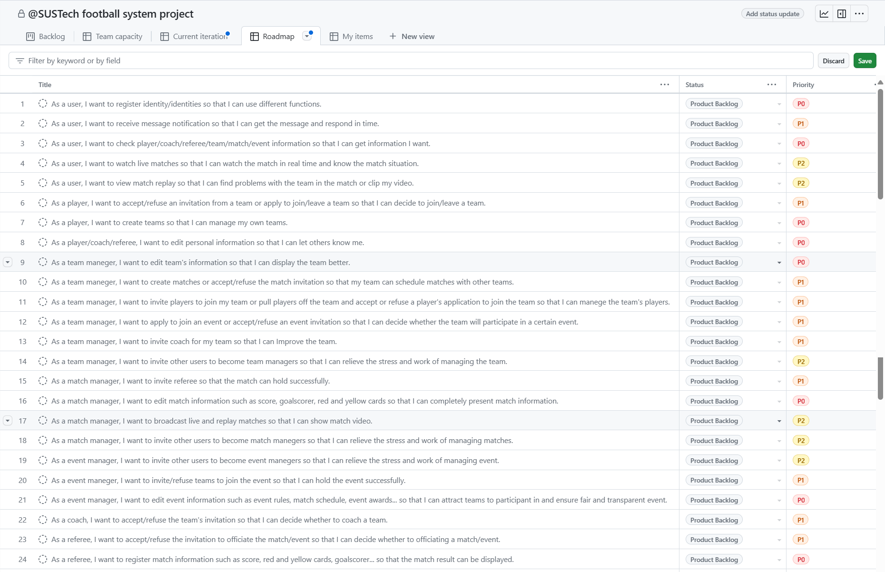

## CS304 Team Project - Proposal Report

### Part I. Project Proposal

#### 项目概述

##### 目标用户

 南方科技大学所有人，以及与南方科技大学足球比赛/赛事相关人员。

##### 系统功能  

实现一个南科大足球赛事系统小程序，使赛事相关人员（例如体育中心）能够通过该小程序管理南科大足球赛事，南科大学生能够通过该小程序获取赛事相关信息。

##### 总体目标

我们的目标是实现一个南科大足球赛事系统小程序，该小程序主要服务于南科大体育中心和校内各足球队，面向全体南科人，旨在促进南科大足球发展，为关注南科大足球和热爱足球的南科人提供更多的信息渠道和便利。

#### 初步需求分析

##### 功能需求 

- 发布并展示来自体育中心的全局性公告和新闻
    - 系统管理员能够编辑和发布全局性公告和新闻
    - 所有用户能够获取并查看全局性公告和新闻
- 允许用户将自己注册为球员、教练、裁判、球队管理者、比赛管理者、赛事管理者等多种身份，实现不同的功能
    - 用户能在主页中发起身份注册的申请，系统管理员可选择同意与否
- 创建球队，管理球队
    - 球队管理者能够创建球队，并编辑球队相关信息（队名，队徽，管理队员等）
- 创建赛事，管理赛事
    - 赛事管理者能够创建赛事，并编辑赛事相关信息（赛事名称，赛事球队，赛事中的比赛结果等）
- 发起比赛，管理比赛
    - 赛事管理员能在赛事管理中添加比赛，并编辑比赛数据（比分，技术统计数据等）
    - 具备球队管理者身份的用户能够与别的球队发起比赛，成为赛事管理者，并编辑比赛数据（同上）
- 搜索南科大赛事相关信息
    - 所有用户可以搜索关于新闻、赛事、比赛、球队、球员等与南科大足球赛事相关的一切数据
- 比赛直播，比赛回放
    - 所有用户可以通过比赛页面提供的信号源观看比赛直播或回放

##### 非功能需求

- 性能：满足南科大学生获取赛事相关信息时不卡顿（查询信息响应时间不超过5秒）
- 可靠性：保护赛事相关信息的更改严格可控
- 安全性：保护用户隐私信息不被泄露
- 易用性：使用户无需教程也能很快了解该小程序的使用
- 产品约束：支持一切能使用微信小程序的设备
- 过程约束：产品应当在书院杯前实现基本功能，并在学期结束前优化和细化其功能

##### 数据需求

- 用户数据：只需要使用时的 session id
- 赛事相关人员数据（球员，教练，裁判等）：通过用户自行在系统中注册得到
- 赛事相关数据（赛事数据，比赛数据，通知，新闻等）：通过赛事管理者发布与管理

##### 技术需求

- 微信小程序
- Spring Boot
- PostgreSQL
- MyBatis-Plus
- 微信开发者工具
- GitHub
- Swagger UI

### Part II. Task Decomposition & Planning

一些我们 Project Board 部分的截图：

### Part III. AI Usage

本部分的 AI 工具使用的是 OpenAI 官网的 ChatGPT 3.5 聊天接口。

本报告全部基于我们成员自己的需求分析，未使用 AI 工具，所以接下来的四个问题我们讲直接讲述 AI 和我们之间的分析的区别。

#### Have you used AI to propose features for the project?

**以下是 AI 提出的新的功能：**

**场地管理**：

- 场地信息：列出校园内所有可用的足球场地，并提供相关信息如位置、场地类型、可用时间等。
- 场地预约：允许用户预约场地，并显示已被预约的时间段。

**通知与提醒**：

- 比赛提醒：向参赛队伍发送比赛提醒，包括比赛时间、地点等信息。
- 预约提醒：提醒用户预约场地的状态和时间。

**数据统计与分析**：

- 比赛数据：统计比赛结果、得分情况等数据，提供数据分析功能。
- 用户活动：统计用户的活动情况，包括预约场地、创建比赛等。

**我们的分析**

对于这个问题，AI 给出了更多功能上的新角度，例如场地位置的信息、预约场地、数据分析、比赛提醒等。

但是由于校内已经有成熟的场地预约系统，我们在实际设计时就没有考虑预约场地的部分。但是比赛提醒和数据分析等确实是一个非常不错的思考方向。

#### Have you used AI to conduct the preliminary requirement analysis?

功能性需求的分析，对于相同的已考虑的功能，AI 与我们自己考虑的大同小异。

**对于非功能性部分：**

对于性能、安全、易用性部分基本一致，但是 AI 提出了更高的要求：

**可维护性需求**：

- 系统应易于维护和升级，包括代码结构清晰、注释完整等方面。
- 系统应具备日志记录功能，以便对系统运行情况进行监控和故障排查。

**可扩展性需求**：

- 系统应具备良好的扩展性，以支持未来可能的新功能和需求。
- 系统架构应灵活，能够方便地集成第三方服务或模块。

以上二者都是软件工程部分重要的组成部分，需要纳入考虑。

对于一个系统来说，可维护性和可拓展性都是十分有必要的。

#### Have you used AI to generate user stories?

以下是 AI 生成的 user story：

**作为学生：**

1. 作为一名学生，我想能够注册一个账号，以便我可以预约校园足球场地进行练习或比赛。
2. 作为一名学生，我想能够查看校园内所有可用的足球场地信息，包括位置、可用时间等，以便我可以选择合适的场地进行预约。
3. 作为一名学生，我想能够创建一个足球队伍，并邀请其他同学加入，以便我们可以一起参加校园足球比赛。
4. 作为一名学生，我想能够查看即将举行的校园足球比赛的日程安排，以便我可以报名参加或观看比赛。

**作为教练：**

1. 作为一名教练，我想能够创建校园足球比赛，并设置比赛时间、地点、参与队伍等信息。
2. 作为一名教练，我想能够查看我的队伍成员的信息，并与他们沟通有关比赛的安排和训练计划。
3. 作为一名教练，我想能够查看比赛结果和统计数据，以便我可以评估队伍的表现和制定进一步的训练计划。

**作为管理员：**

1. 作为一名管理员，我想能够管理校园内的足球场地信息，包括添加、编辑和删除场地信息。
2. 作为一名管理员，我想能够审核用户注册申请，以确保只有合法的学生和教职员工可以注册账号。
3. 作为一名管理员，我想能够管理校园足球比赛的信息，包括创建比赛、审核报名等。

相较于我们的内容，AI 与我们的不同主要在于角色的分配和角色功能实现的细节不同。

比如在我们的设想中，球员只能受管理员管理，并不能自主创建比赛。

而教练/球队管理员中的功能较少确实可以再添加一点。

#### Have you used AI to generate issues or tasks?

**AI 生成的问题或任务列表：**

1. 场地信息不准确或不完整
2. 比赛日程安排冲突
3. 用户体验问题
4. 性能问题
5. 安全漏洞
6. 跨平台兼容性问题
7. 用户反馈处理
8. 系统备份和恢复机制缺失

相较于我们简单的 task 分配，AI 更加偏向于细节上和专业性上的要求。

比如性能、安全和兼容性等等的考虑。但是由于我们的项目尚且处于前期，这些部分可以纳入我们以后考虑的范围内。

#### Conclusion

AI 显然可以帮助我们对一些项目功能的内容的分析。它能为我们提供第一手的简单直接的需求分析，帮助我们来考虑项目的着手点。并且，它能提出一些普遍上的功能建议，例如隐私性和安全性等。

但是也有明显的弊端：比如它不能直接对很实际性的情况进行分析：在我们小组的项目中，我们考虑做的是一个实际上的足球活动管理客户端，因此要结合本校的实际进行需求分析。在实际分析中就得出诸如预约系统不需集成的新的功能见解。

总得来说，AI 能够显著地辅助我们对项目的分析。但是涉及到具体的功能细节和一些开发上的随机应变，就需要我们开发人员自己进行脚踏实地的分析。在目前的开发情景下，AI 可以作为开发人员的得力助手，辅助开发人员的开发。